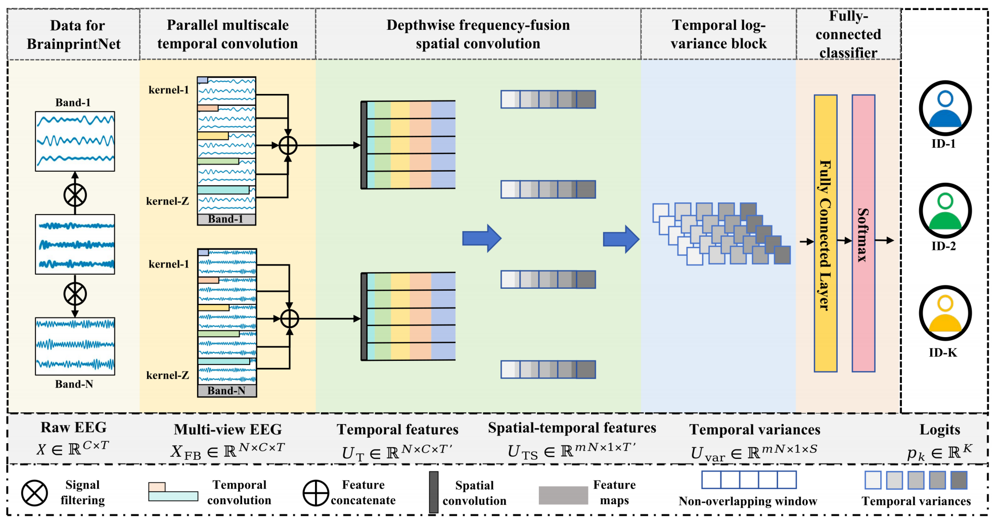

<div align="center">
<h1>BrainprintNet</h1>
<h3>A Multiscale Cross-Band FusionNetwork for EEG-Based Brainprint Recognition</h3>

[Yunlu Tu](https://scholar.google.com/citations?hl=en&user=dtDMET8AAAAJ)<sup>1</sup>, [Siyang Li](https://scholar.google.com/citations?user=5GFZxIkAAAAJ&hl=en)<sup>1</sup>, [Xiaoqing Chen](https://scholar.google.com/citations?hl=en&user=LjfCH7cAAAAJ)<sup>1,2</sup>, and [Dongrui Wu](https://scholar.google.com/citations?user=UYGzCPEAAAAJ&hl=en)<sup>1,2 :email:</sup>

<sup>1</sup> School of Artificial Intelligence and Automation, Huazhong University of Science and Technology

<sup>2</sup> Zhongguancun Academy
(<sup>:email:</sup>) Corresponding Author

</div>

> This repository contains the implementation of our paper: [**"BrainprintNet: A Multiscale Cross-Band FusionNetwork for EEG-Based Brainprint Recognition"**](https://ieeexplore.ieee.org/abstract/document/11424605/).

## Abstract

User identification technologies are essential for ensuring security and privacy. Compared to conventional biometric identification methods, electroencephalogram (EEG)-based brainprint recognition provides unique advantages, including non-replicability, resistance to coercion, and inherent liveness detection. However, existing EEG-based brainprint recognition methods are typically tailored for specific tasks and evaluated under conditions that differ substantially from real-world use. To overcome these limitations, we propose BrainprintNet, a convolutional neural network architecture integrating fine-grained filter banks, grouped multiscale temporal convolutions, and cross-band spatial fusion to enhance EEG-based brainprint recognition. BrainprintNet surpasses previous architectures in challenging scenarios involving simultaneous cross-session and cross-task recognition, demonstrating its generalization ability under strict simulation for real-world applications. Comprehensive experiments were conducted using three publicly available datasets encompassing nine distinct tasks. Furthermore, visualization of the learned network weights revealed strong correlations between user identity and specific EEG frequency subbands and channels. The proposed BrainprintNet significantly advances the accuracy, flexibility, and practical applicability of EEG-based brainprint recognition systems.


## Project Structure

```text
.
├── .gitignore
├── LICENSE
├── README.md
├── requirements.txt
├── run.py
└── src
    ├── __init__.py
    ├── __main__.py
    ├── catalog.py
    ├── cli.py
    ├── config.py
    ├── logging_config.py
    ├── utils.py
    ├── data
    │   ├── __init__.py
    │   ├── alignment.py
    │   ├── augmentation.py
    │   ├── datasets.py
    │   ├── loaders.py
    │   └── preprocessing.py
    ├── models
    │   ├── __init__.py
    │   ├── BrainprintNet.py
    │   ├── CNN.py
    │   ├── Conformer.py
    │   ├── common.py
    │   ├── filter_bank.py
    │   └── registry.py
    ├── training
    │   ├── __init__.py
    │   ├── engine.py
    │   ├── evaluation.py
    │   └── losses.py
    └── outputs
        ├── checkpoints
        ├── legacy_artifacts
        ├── logs
        └── reports
```

## Installation

```bash
python -m venv .venv
source .venv/bin/activate
pip install -r requirements.txt
```

## Quick Start

查看支持的数据集和模型：

```bash
python -m src --list-datasets
python -m src --list-models
```

运行跨会话实验：

```bash
python -m src \
  --mode baseline \
  --dataset 001 \
  --model BrainprintNet \
  --data-root /path/to/data
```

运行跨任务实验：

```bash
python run.py \
  --mode cross-task \
  --cross-tasks MI ERP \
  --model BrainprintNet \
  --session-num 1 \
  --data-root /path/to/data
```

## Directory Guide

- `src/cli.py`：命令行参数解析与任务调度
- `src/config.py`：实验配置、路径配置、数据集元信息
- `src/data/`：数据读取、预处理、增强、DataLoader 组织
- `src/models/`：模型定义与模型注册
- `src/training/`：训练循环、损失函数、评估逻辑
- `src/logging_config.py`：全局日志配置
- `src/utils.py`：公共工具函数
- `run.py`：仓库根目录快捷启动脚本

## Supported Datasets
- `M3CV`: [paper](https://www.sciencedirect.com/science/article/pii/S105381192200787X) and [dataset](https://www.kaggle.com/competitions/eeg-biometric-competition/data)
- `OpenBMI`: [paper](https://academic.oup.com/gigascience/article/8/5/giz002/5304369?login=false&guestAccessKey=) and [dataset](https://ftp.cngb.org/pub/gigadb/pub/10.5524/100001_101000/100542/)
- `LingJiu`: Derived from our previous projects; if you want to use this dataset, please contact [Yunlu Tu](#contact).


## Supported Models
We implemented the following deep learning models：
`BrainprintNet`, `MSNet`, `CBFNet`, `EEGNet`, `DeepConvNet`, `ShallowConvNet`, `1D-LSTM`, and we express our gratitude to the authors of the following open-source models:
- [`Conformer`](https://github.com/eeyhsong/EEG-Conformer)
- [`FBCNet`](https://github.com/ravikiran-mane/FBCNet)
- [`FBMSNet`](https://github.com/Want2Vanish/FBMSNet)
- [`IFNet`](https://github.com/Jiaheng-Wang/IFNet)
- [`GWNet`](https://www.kaggle.com/code/nischaydnk/hms-submission-1d-eegnet-pipeline-lightning/notebook?scriptVersionId=160814854)

## Contact
Please contact me at [yltu@hust.edu.cn](mailto:yltu@hust.edu.cn) or [hust_mx721@163.com](mailto:yltu@hust_mx721@163.com)  for any questions regarding the paper, and use Issues for any questions regarding the code.

## Citation

If you find this work helpful, please consider citing our paper:
```
@Article{Tu2026BrainprintNet,
  author  = {Yunlu Tu and Siyang Li and Xiaoqing Chen and Dongrui Wu},
  journal = {{IEEE} Trans. on Information Forensics and Security},
  title   = {{BrainprintNet}: A multiscale cross-band fusion network for {EEG}-based brainprint recognition},
  year    = {2026},
  pages   = {2757--2768},
  volume  = {21},
  doi     = {10.1109/TIFS.2026.3672000},
}

```

## Acknowledgements
All credit of the transfer learning baselines goes to [Siyang Li](https://github.com/sylyoung), do check out the [DeepTransferEEG](https://github.com/sylyoung/DeepTransferEEG) project.